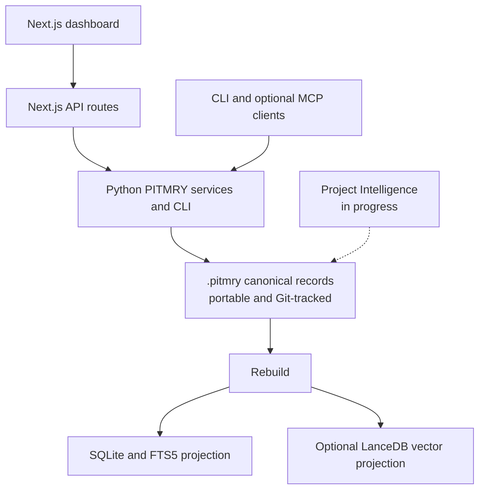

# pitmry

**PITMRY** is an offline project-memory backend with a local dashboard. It stores canonical records in each project's `.pitmry/` directory and rebuilds SQLite/FTS and optional LanceDB indexes from those records.

The app and memory store run locally. Optional integrations, package installation, or setup may require network access. PITMRY does not send telemetry.

**GitLab Repository:** [https://gitlab.com/pitmhs/pitmry](https://gitlab.com/pitmhs/pitmry)

---

## Table of Contents

1. [Overview](#overview)
2. [Why pitmry?](#why-pitmry)
3. [System Architecture](#system-architecture)
4. [Core Subsystems and Features](#core-subsystems-and-features)
   - [Efferd App Shell & Layout](#efferd-app-shell--layout)
   - [Devl.dev Timeline Subsystems](#devldev-timeline-subsystems)
   - [Split-Resizable Code Diff Viewer](#split-resizable-code-diff-viewer)
   - [Stream View & Relational Inspector](#stream-view--relational-inspector)
   - [Record Relationships](#record-relationships)
   - [Command Palette & Search](#command-palette--search)
   - [Dashboard and Skills](#dashboard-and-skills)
5. [API Reference](#api-reference)
6. [Data Models](#data-models)
7. [Dependencies](#dependencies)
8. [Installation & Setup](#installation--setup)
9. [Running the Server](#running-the-server)
10. [Keyboard Shortcuts](#keyboard-shortcuts)
11. [Project Directory Layout](#project-directory-layout)
12. [Project Intelligence](#project-intelligence)
13. [GitLab and GitHub](#gitlab-and-github)
14. [Architecture History](docs/ARCHITECTURE.md)

---

## Overview

Modern software development generates vast amounts of context across sessions, branches, and repositories. Traditional notes, pull request comments, and git commit logs quickly fragment. When developers switch projects, context is lost.

PITMRY keeps project memory portable in Git. The dashboard displays record authority, resolved state, and whether a relation is explicit or inferred. It does not treat similarity or time order as proof of cause.



---

## Why pitmry?

- **100% Offline & Private**: All data stays on your local filesystem. No external cloud service or subscription is needed.
- **Portable canonical memory**: `.pitmry/` is the durable source. SQLite and LanceDB are disposable projections.
- **Trust-aware retrieval**: FTS5 and optional vectors rank records; context reports state, authority, conflicts, and abstention.
- **Evidence-backed lineage**: Explicit relations require evidence. Similarity and shared files remain inferred hints.
- **Local Git capture**: Captured commits retain their full SHA and objective metadata.
- **Zero-Daemon Python Integration**: The web server invokes Python CLI commands on demand. There is no long-running Python background service consuming memory.

---

## System Architecture

### 1. Canonical store and projections

`.pitmry/records/` contains immutable canonical records and is committed with the project. `.pitmry-cache/` contains disposable SQLite/FTS and optional LanceDB projections. Run `python -m server.pitmry rebuild` to recreate the projections. Use `--no-vectors` when local embedding support is unavailable.

### 2. Python Services

The frontend does not read database files directly. Next.js routes invoke the local Python backend and return JSON. Canonical records remain authoritative; SQLite/FTS and optional vector indexes can be rebuilt.

Selected dashboard flows include demo data. Agent context APIs use the real backend and do not return demo records.

Benefits:
- Clean decoupling between the Python data science toolchain and the TypeScript web application.
- No need to maintain a separate persistent FastAPI or Flask daemon.
- Safe argument passing with OS-level process isolation.
- Projection health is reported separately from canonical-store health.

### 3. Layered Frontend Hierarchy

- **Next.js 16 (App Router)** with React 19 and Turbopack.
- **Tailwind CSS v4** using CSS-first `@theme` variables and OKLCH color values.
- **Single Nested Wrapper Architecture**: Prevents double borders, unnecessary scrollbars, and padding clutter.
- **Controlled Z-Index Layering**:
  - `z-10`: Sticky headers and day dividers.
  - `z-40`: Main application header and navigation bar.
  - `z-50`: Dropdown menus and notification popover trays.
  - `z-[90]`: Animated floating toast notifications.
  - `z-[100]`: Modal dialogs and the split-resizable code diff viewer.

---

## Core Subsystems and Features

### Efferd App Shell & Layout

The dashboard layout is built on `@efferd/app-shell-4`, unstyled accessible `@base-ui/react` primitives, and `@hugeicons/react`.

- **Collapsible Sidebar**: Uses `collapsible="icon" variant="floating"`. Press `⌘B` or click the toggle icon in the header to collapse the sidebar into an icon-rail. This maximizes screen space for diff viewing and graph exploration.
- **Dynamic Navigation Sections**: Automatically groups records by Projects, Record Types (`ADRs`, `Commits`, `Discussions`), and top Tags with live item counts.
- **Responsive Breadcrumbs**: Displays the current view path and active filters at a glance.

### Devl.dev Timeline Subsystems

Pitmry integrates four specialized developer timeline components:

1. **System Readiness (`timelines-status-page.tsx`)**:
   - Reports current checks for canonical storage and available projections.
   - It does not claim historical uptime monitoring.

2. **Deployment Records (`timelines-deploys.tsx`)**:
   - Displays captured canonical deployment records only. It does not infer an environment or deployment from a Git commit.
   - Git changes and their available diffs are shown through the activity and record-inspection views.

3. **Activity Feed (`timelines-activity-feed.tsx`)**:
   - Groups activities under sticky date dividers: `Today`, `Yesterday`, and `Earlier this week`.
   - Category filter tabs: `All`, `Commits`, `Decisions`, and `Architecture`.
   - Direct record inspection links.

4. **Notifications (`timelines-notifications.tsx` & `notification-toast.tsx`)**:
   - Shows notification records when captured. No unread count, polling, or toast is implied by an empty canonical store.

### Split-Resizable Code Diff Viewer

Integrated with the `@coss` registry and customized for pitmry:

- **4 View Modes**:
  - `Inline`: Unified single-column view with colored line additions and deletions.
  - `Split`: Side-by-side comparison of old vs. new line contents.
  - `Preview`: Formatted preview of modified files.
  - `Resizable`: Dynamic drag-to-resize split view (`split-resizable.tsx`) with percentage-based splitter handles and min/max width clamping.
- **Rich Syntax Highlighting**: Powered by `prism-react-renderer` across TypeScript, JavaScript, Python, CSS, and Markdown.
- **Delta Percentage Badge**: Computes change density (`+X% / -Y%`) based on hunk additions and deletions.
- **Dual Copy Actions**: One-click "Copy Patch" (copies raw git unified diff) and "Copy Code" (copies current file content).
- **Editor Deep Links**: Direct URL handlers (`vscode://file/...` and `zed://file/...`) to jump immediately to the modified file in your preferred local editor.

### Stream View and Relational Inspector

- **Stream View**: Paginated canonical records with supported filters.
- **Relational Inspector**: Record metadata, provenance, content, and links.
- **Decision Journey Tab**: Shows the focal record and evidence-backed explicit relations. It does not assign causal roles to unlinked records.
- **Neighbors Tab**: Separates explicit relations from inferred candidates; missing similarity values remain unavailable rather than fabricated.

### Record Relationships

- Explicit evidence-backed relations are separate from inferred associations. Similarity does not establish causality or supersession.
- The legacy 2D graph may show project membership and relation hints. Canonical data does not currently provide a 3D spatial projection.

### Command Palette & Search

- Press `⌘K` or `Ctrl+K` to open the palette.
- Search uses canonical records with lexical retrieval and optional vector retrieval.
- Agent context includes resolved state and trust metadata, and can abstain when evidence is insufficient.

### Dashboard and Skills

The dashboard includes stream, record inspection, activity, readiness, skills, and Project Intelligence views. Available information depends on the configured local backend and captured records.

---

## API Reference

All requests target `GET /api/memory` with the `action` query parameter.

| Action | Description | Parameters |
|---|---|---|
| `summary` | System statistics, projects list, top tags | None |
| `workspace` | Project counts, latest records, current decisions, and conflicts from canonical records | None |
| `records` | Server-filtered canonical records with an offset cursor and resolved state | `project`, `type`, `tag`, `query`, `state`, `from`, `to`, `cursor`, `limit` |
| `record` | Full canonical record, provenance, content, files, and explicit or inferred links | `item_id` canonical ID |
| `readiness` | Dashboard-shaped canonical, SQLite, FTS, vector, and Git checks | None |
| `feed` | Legacy bounded records feed with search & filters | `project`, `type`, `tag`, `query`, `limit` |
| `relations` | Explicit evidence-backed links and separately labeled inferred hints | `item_id` canonical ID |
| `journey` | Canonical explicit lineage; no inferred causal chain | `item_id` canonical ID, `hops` |
| `graph` | Project membership, explicit relations, inferred associations | None |
| `galaxy` | Degraded response until a supported spatial projection exists | None |
| `diff` | Git diff resolved from a canonical Git-change record | `project`, `commit` or `item_id` |
| `health` | Independent canonical, SQLite, FTS, vector, and Git checks | None |
| `deploys` | Empty until deployment records are captured | None |
| `activity` | Canonical records grouped by capture date | None |
| `notifications` | Empty until a canonical notification source is defined | None |

Agent clients can use the CLI or the PITMRY MCP tools available in their checkout. HTTP clients can use `POST /api/v1/memory/context`; this endpoint does not return demo data.

The existing stream uses `records` and loads additional pages on request. Its inspector fetches `record` to show authority, truth domain, source, related files, and complete content. These actions return an error when the local backend is unavailable; they do not substitute sample records. Legacy actions remain available for existing clients and views.

---

## Data Models

### Record
```typescript
interface Record {
  id: string;                      // e.g. "dec_<24 hex chars>"
  type: string;                    // dashboard-compatible label
  canonical_type: string;
  project: string;
  title: string;
  summary: string;
  timestamp: string;               // timezone-aware ISO-8601
  tags: string[];
  authority: string;
  truth_domain: string;
  state: string;                   // resolver output, not a manually edited flag
  provenance: object;
  decision?: string;               // Decision body (for ADRs)
  rationale?: string;              // Architectural rationale
  trade_offs?: string;
  architectural_impact?: string;
  commit_hash?: string;
  branch?: string;
  author?: string;
  key_files?: string[];
  questions?: string;
  answers?: string;
}
```

### DiffFile & DiffHunk
```typescript
interface DiffFile {
  path: string;
  full_path: string;
  additions: number;
  deletions: number;
  is_binary: boolean;
  hunks: DiffHunk[];
}

interface DiffHunk {
  header: string;                  // e.g. "@@ -1,6 +1,7 @@"
  context_hint: string;
  old_start: number;
  new_start: number;
  lines: DiffLine[];
}

interface DiffLine {
  type: "addition" | "deletion" | "context";
  content: string;
  old_num: number | null;
  new_num: number | null;
}
```

---

## Dependencies

### Production Dependencies
- **`next`** `16.3.6`: React framework with App Router.
- **`react`** & **`react-dom`** `19.2.4`: React 19 concurrent features.
- **`three`** `^0.186.0`: WebGL library used by the legacy spatial view.
- **`@base-ui/react`** `^1.8.0`: Headless, accessible primitives (Tooltips, Collapsibles, Buttons) powering the Efferd sidebar.
- **`@hugeicons/react`** & **`@hugeicons/core-free-icons`**: Complete SVG icon family for dashboard navigation.
- **`prism-react-renderer`** `^2.4.1`: Syntax highlighting for the code diff viewer.
- **`clsx`**, **`tailwind-merge`**, **`class-variance-authority`**: Type-safe CSS utility composition.
- **`lucide-react`**: System icons for diff operations, command palette, and timelines.

### Runtime Requirements
- **Node.js 20+** and **pnpm** (or npm / yarn).
- **Python 3.10+** (only required for full local memory persistence; not required for Demo Mode).
  - Bundled dependencies in `server/requirements.txt`: `lancedb`, `pyarrow`, `numpy`, `scikit-learn`, `onnxruntime`, `tokenizers`.
  - Automatically installed by `pnpm setup`.

---

## Installation & Setup

You can run `pitmry` in two ways:

### Local Setup

Install and start the dashboard and local backend:

```bash
# 1. Clone the repository
git clone https://gitlab.com/pitmhs/pitmry.git
cd pitmry

# 2. Install Node dependencies
pnpm install

# 3. Run automated backend setup (provisions venv & bootstraps databases)
pnpm setup

# 4. Verify system readiness
pnpm doctor

# 5. Start the development server
pnpm dev
```

### CLI Diagnostic Tools

- **`pnpm setup`**:
  - Prepares the local Python environment and dependencies.
- **`pnpm doctor`**:
  - Checks canonical storage and available projections.

### Custom Configuration

You can configure repositories that the dashboard should read:

1. **Via `pitmry.config.json`**:
   ```bash
   cp pitmry.config.example.json pitmry.config.json
   ```
   Set `tracked_repos` to project roots. Paths can be absolute or relative to the configuration file. Each root must contain `.pitmry/manifest.json`.

2. **Via environment variables (`.env`)**:
   ```bash
   cp .env.example .env
   ```
   Supported variables:
   - `PYTHON_BIN`: Path to Python executable (defaults to `.venv` or system `python`).
   - `PITMRY_ROOT`: Optional project root for CLI use.
   - `PITMRY_ONNX_MODEL` and `PITMRY_TOKENIZER`: Optional paths to already-installed local model files. PITMRY does not download them.

---

## Running the Server

### Development Mode (with Turbopack)
```bash
pnpm dev
```
Open [http://localhost:4242](http://localhost:4242) in your browser.

### Production Build & Launch
```bash
pnpm build
pnpm start
```

### Windows One-Click Launchers
- **`launch.bat`**: Starts the production server in a dedicated command window.
- **`launch.ps1`**: PowerShell script with environment check and automated launch.

---

## Keyboard Shortcuts

| Shortcut | Action |
|---|---|
| `⌘K` / `Ctrl+K` | Open Command Palette (full-text & semantic search) |
| `⌘B` / `Ctrl+B` | Toggle Sidebar (collapse to icon rail / expand) |
| `Escape` | Close Command Palette or modal diff viewer |

---

## Project Directory Layout

```
pitmry/
├── app/
│   ├── api/
│   │   └── memory/
│   │       ├── demo-data.ts           # Built-in demo fallback dataset
│   │       └── route.ts               # API bridge: shells out to server script
│   ├── globals.css                    # Tailwind v4 @theme, tokens, OKLCH colors
│   ├── layout.tsx                     # Root layout, TooltipProvider, metadata
│   └── page.tsx                       # Dashboard entry point (<AppShell />)
├── components/
│   ├── app-shell.tsx                  # Root layout: Sidebar + Header + Views + Demo Banner
│   ├── app-shared.tsx                 # Navigation links and state definitions
│   ├── code-diff-viewer.tsx           # Split-resizable diff viewer with syntax highlighting
│   ├── command-palette.tsx            # ⌘K instant search overlay
│   ├── decision-journey.tsx           # DAG multi-hop decision tree stepper
│   ├── design-token-controller.tsx    # Live runtime CSS variable customizer
│   ├── project-intelligence-view.tsx  # Project Intelligence dashboard
│   ├── knowledge-graph.tsx            # 2D Canvas force-directed graph
│   ├── relational-inspector.tsx       # Record detail, journey, and neighbors panel
│   ├── stat-tile.tsx                  # Metric cards with sparklines
│   ├── timelines-activity-feed.tsx    # Sticky day-divider activity feed
│   ├── timelines-deploys.tsx          # Multi-repo git deploy & commit tracker
│   ├── timelines-notifications.tsx    # Notification center popover tray
│   ├── timelines-status-page.tsx      # System health & 60-day uptime bars
│   └── ui/                            # Primitives: buttons, badges, split-resizable, etc.
├── docs/
│   └── sessions/                      # Offline markdown session logs & decision records
├── scripts/
│   ├── doctor.mjs                     # Diagnostic health inspector (pnpm doctor)
│   └── setup.mjs                      # Automated 1-command setup CLI (pnpm setup)
├── server/
│   ├── pitmry/                        # Canonical store, retrieval, PI, CLI, MCP
│   ├── memory_dashboard_api.py        # Dashboard compatibility API
│   └── requirements.txt               # Backend Python dependencies
├── .env.example                       # Template for environment configuration
├── components.json                    # shadcn & @coss registry configuration
├── package.json                       # Scripts and dependency declarations
├── pitmry.config.example.json         # Template for repository & path mapping
├── tsconfig.json                      # Strict TypeScript configuration
└── README.md                          # Comprehensive documentation
```

---

## Project Intelligence

Project Intelligence links source intent to accepted requirements, planned work, sessions, implementation evidence, verification, and incidents. The backend preserves source Markdown and accepts externally prepared, validated decompositions; it does not call an LLM. The detailed PRD remains proposed, and current implementation coverage is narrower than that product vision.

The current working tree includes CLI operations for intake, decomposition import, reconciliation, baseline review, work planning/readiness, session lifecycle, evidence, verification, staleness, incident tracking, context, and release readiness. Run `python -m server.pitmry pi --help` to inspect the commands available in the checkout you are using. This README update does not publish the separate uncommitted implementation changes.

See the [Project Intelligence PRD](docs/PROJECT-INTELLIGENCE-PRD.md), [backend specification](docs/PROJECT-INTELLIGENCE-BACKEND-SPEC.md), and [architecture history](docs/ARCHITECTURE.md).

Git capture hooks are opt-in. The post-commit adapter is fail-open and does not replace an existing hook.

## GitLab and GitHub

| Field | Value |
|---|---|
| **Project Name** | `pitmry` |
| **GitLab URL** | [https://gitlab.com/pitmhs/pitmry](https://gitlab.com/pitmhs/pitmry) |
| **GitHub URL** | [https://github.com/pitmhz/pitmry](https://github.com/pitmhz/pitmry) |
| **Description** | Offline-first project memory and project intelligence with a local dashboard. |
| **Visibility** | Private / Personal |
| **Maintainer** | Pieter ([@pitmhs](https://gitlab.com/pitmhs)) |

---

## License

Personal project by Pieter ([@pitmhs](https://gitlab.com/pitmhs)). All rights reserved.
