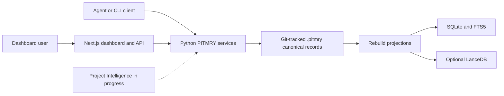

# PITMRY Architecture and Milestones

This page summarizes the current architecture and the core implementation sequence. The repository source and tests define current behavior. The Project Intelligence PRD and backend specification define a larger proposed target.

## Current Architecture

`.pitmry/records/` is durable canonical state. SQLite/FTS5 and LanceDB are rebuildable projections. Explicit, evidence-backed relations are distinct from inferred retrieval candidates. Similarity does not prove causality, supersession, or implementation.

The Next.js application provides the local dashboard and HTTP routes. Python services own canonical record validation, retrieval, state resolution, projection rebuilds, Git capture, and optional MCP tools. Project Intelligence implementation work exists in the local working tree but is not included in this documentation commit. No cloud service is required to store or query canonical project records; optional setup and integrations may have separate requirements.

## Core Implementation Milestones

These milestones are summarized from Git history and PITMRY memory records. Older memory records contain imported or agent-reported authority, so use linked source, tests, and commits when verifying specific behavior.

1. **Canonical store** (`8157f5f`): establish portable, stable, Git-tracked records as the source of truth.
2. **Backend hardening** (`1899b5a`): add projections and migration/rebuild behavior while keeping SQLite/FTS and LanceDB derived and disposable.
3. **Retrieval trust** (`80aaebb`): expose state conflicts and explicit lineage without turning similarity into relationships or causal claims.
4. **Agent API, UI, and release gates** (`041bf34`): extend the CLI/API and dashboard integration, compatibility, tests, evaluation, and readiness checks.
5. **Project Intelligence**: current uncommitted work adds intake, planning, sessions, verification, incidents, context, release readiness, dashboard presentation, and opt-in Git hooks. Treat these as local working-tree changes until reviewed and published. The full PRD remains a proposed target.

## Documentation Map

- [Project Intelligence PRD](PROJECT-INTELLIGENCE-PRD.md): product requirements and intended scope.
- [Project Intelligence backend specification](PROJECT-INTELLIGENCE-BACKEND-SPEC.md): proposed detailed backend contract.
- `docs (gitignore THIS) IMPORTANT ARCHITECTURE REBUILD/`: tracked historical implementation runbook archive. Its old file references describe a planned rebuild, not necessarily the current package layout.

## Trust and Status Rules

- Canonical records are authoritative; projection databases can be rebuilt.
- Evidence-backed relations and inferred candidates must remain distinguishable.
- A record's current state is resolved from canonical events and relations; search rank alone does not set state.
- Implementation evidence is not verification evidence. Verification must be tied to its recorded inputs and may become stale.
- A planned Project Intelligence capability is not complete merely because its data model appears in the PRD.
